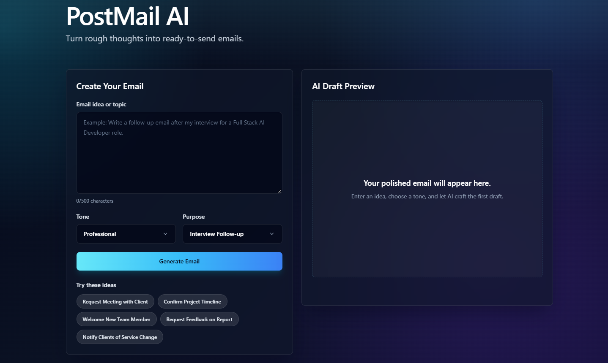
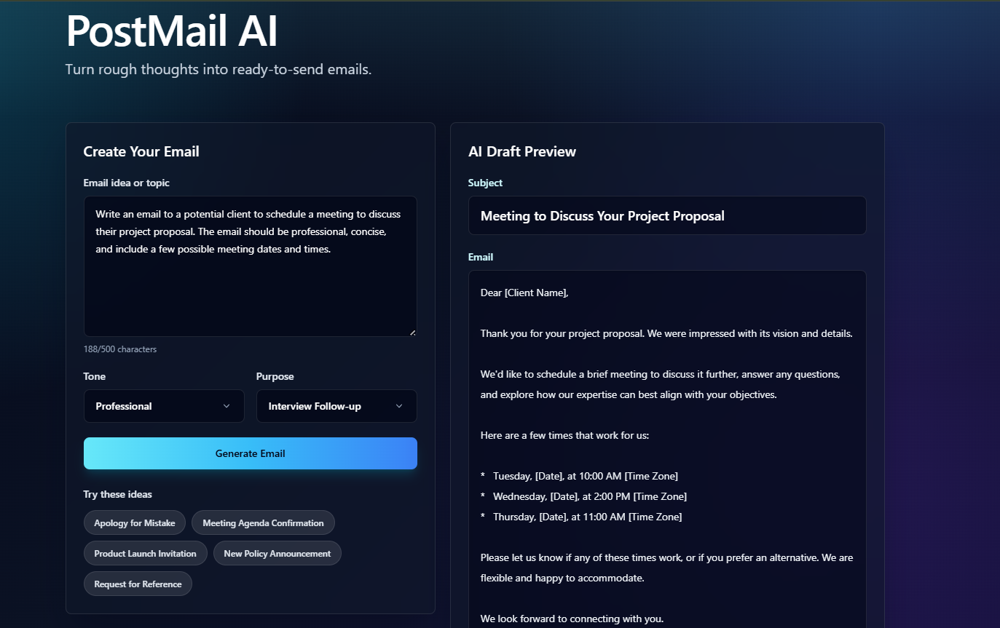
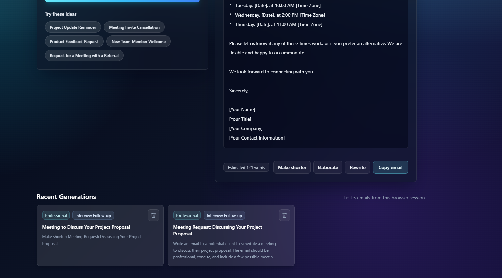
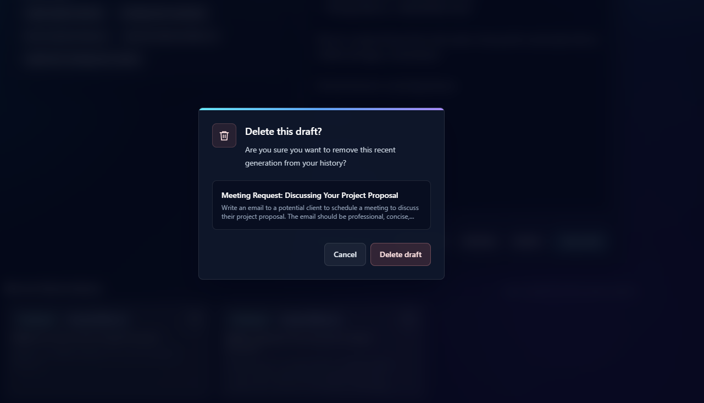
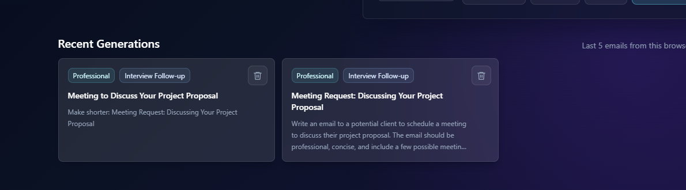

# PostMail AI - AI Email Generator

## Project Overview

PostMail AI is a full-stack AI-powered email generator that converts rough user prompts into polished, professional emails. Users can enter an email idea, choose a tone, select an email purpose, and generate a ready-to-send subject and email body.

The project is designed for a Full Stack AI Developer assignment. It keeps the backend simple and reliable while making the frontend feel like a modern SaaS product.

## Screenshots

### Home and Empty Preview



### Generated Email Preview



### Recent Generations and Quick Actions



### Delete Confirmation



### Recent Generations



## Features

- AI email generation
- Subject generation
- Tone selector
- Purpose selector
- Gemini primary provider
- Groq fallback provider
- Copy-to-clipboard
- Shorten, elaborate, and regenerate actions
- Click-to-open recent generations
- Responsive SaaS-style UI
- FastAPI backend
- Error handling
- Clean project structure

## Tech Stack

Frontend:

- Next.js
- React
- TypeScript
- Tailwind CSS

Backend:

- FastAPI
- Python
- Pydantic

AI:

- Gemini API
- Groq API fallback

## Architecture Explanation

The application follows a simple client-server architecture. The Next.js frontend collects the user's email idea, selected tone, and email purpose. It sends this data to the FastAPI backend. The backend validates the request, creates a structured AI prompt, and first tries to generate the email using Gemini. If Gemini fails, the backend automatically retries using Groq as a fallback provider. Once the AI response is received, the backend returns a clean subject, email body, and provider name to the frontend. The frontend displays the result with copy and recent history features.

## Why Gemini + Groq Fallback?

Gemini is used as the primary LLM provider. Groq is used as a fallback provider to improve reliability. If Gemini has an API error, quota issue, or temporary failure, the backend can still complete the request using Groq. This keeps the frontend simple and improves the overall user experience.

## Project Structure

```text
PostMail-Email-Generator/
|-- .gitignore
|-- README.md
|-- backend/
|   |-- main.py
|   |-- requirements.txt
|   |-- .env.example
|   `-- README.md
`-- frontend/
    |-- app/
    |   |-- page.tsx
    |   |-- layout.tsx
    |   `-- globals.css
    |-- package.json
    |-- package-lock.json
    |-- postcss.config.js
    |-- tailwind.config.ts
    |-- tsconfig.json
    |-- next-env.d.ts
    |-- .env.local.example
    `-- README.md
```

## Cleanup and Submission Notes

The project is cleaned for GitHub submission. Generated folders such as `node_modules/`, `.next/`, `__pycache__/`, and virtual environments are ignored through `.gitignore`.

Do not commit real API key files:

- `backend/.env`
- `frontend/.env.local`

Keep these example files in the repository so reviewers know which environment variables are required:

- `backend/.env.example`
- `frontend/.env.local.example`

If `node_modules/` is missing after cleanup, reinstall frontend dependencies:

```bash
cd frontend
npm install
```

## Backend Setup

```bash
cd backend
python -m pip install -r requirements.txt
```

Create `.env` file:

```env
GEMINI_API_KEY=your_gemini_api_key_here
GROQ_API_KEY=your_groq_api_key_here
FRONTEND_ORIGINS=http://localhost:3000,http://127.0.0.1:3000
```

Run:

```bash
python -m uvicorn main:app --host 127.0.0.1 --port 8000
```

Backend URL:

```text
http://127.0.0.1:8000
```

API Docs:

```text
http://127.0.0.1:8000/docs
```

## Frontend Setup

```bash
cd frontend
npm install
```

Create `.env.local`:

```env
NEXT_PUBLIC_API_URL=http://127.0.0.1:8000
```

Run:

```bash
npm run dev
```

Frontend URL:

```text
http://localhost:3000
```

## API Documentation

`POST /generate-email`

Request:

```json
{
  "prompt": "Write a follow-up email after an interview",
  "tone": "Professional",
  "purpose": "Interview Follow-up"
}
```

Response:

```json
{
  "subject": "Follow-Up Regarding Interview Opportunity",
  "email": "Dear Hiring Manager...",
  "provider": "Gemini"
}
```

`POST /refine-email`

Request:

```json
{
  "subject": "Leave Request for Tomorrow",
  "email": "Dear Manager...",
  "tone": "Professional",
  "purpose": "Leave Request",
  "action": "shorten"
}
```

Supported actions:

- `shorten`
- `elaborate`
- `regenerate`

`GET /prompt-ideas`

Returns fresh prompt suggestion chips generated with Groq.

## Demo Script

Hi, this is PostMail AI, my Full Stack AI Developer assignment. It is an AI-powered email generator built using Next.js, FastAPI, Gemini API, and Groq fallback. The user can enter an email idea, select a tone and purpose, and generate a polished email instantly. The backend handles validation, prompt creation, Gemini API integration, fallback to Groq if Gemini fails, and error handling. I also added bonus features like subject generation, copy-to-clipboard, prompt suggestions, recent history, and quick edit actions to make the draft shorter, elaborate, or rewrite it.

## Future Improvements

- User authentication
- Database storage
- Streaming response
- Multiple email templates
- Rich text editor
- Export email as PDF
- User dashboard

## Author

Author:
Akash
